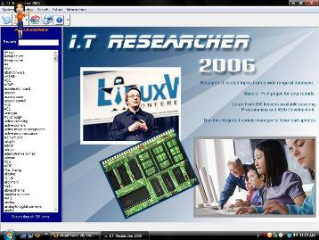



## IT Researcher 2006

### Description

IT Researcher 2006 is an encyclopedia program written in vb6. I created this a project for our school.

Core features of this program include updating, managing favorites, fast searching using API calls, included WinHelp file, Uses Microsoft Agent and Text to Speech Engine.

Lots of things to learn from this program.
 
### More Info
 

             |
---                |---
**Submitted On**   |2006-10-18 23:36:16
**By**             |[Arjay C\. Nacion](https://github.com/Planet-Source-Code/PSCIndex/blob/master/ByAuthor/arjay-c-nacion.md)
**Level**          |Advanced
**User Rating**    |4.0 (8 globes from 2 users)
**Compatibility**  |VB 5\.0, VB 6\.0
**Category**       |[Complete Applications](https://github.com/Planet-Source-Code/PSCIndex/blob/master/ByCategory/complete-applications__1-27.md)
**World**          |[Visual Basic](https://github.com/Planet-Source-Code/PSCIndex/blob/master/ByWorld/visual-basic.md)
**Archive File**   |[IT\_Researc20262410202006\.zip](https://github.com/Planet-Source-Code/arjay-c-nacion-it-researcher-2006__1-66844/archive/master.zip)

